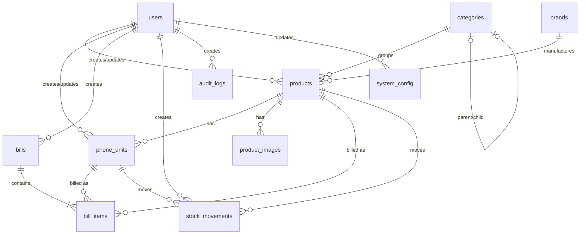

# Database ERD & Relational Design Specification

This document defines the Entity Relationship Diagram (ERD), table structures, indexes, foreign key relationships, and data constraints of the database layer for the Used Mobile shop system.

---

## Entity Relationship Diagram (ERD)

The following diagram shows the logical relationships between the database entities. 

---

## Schema Overview & Relational Design

The database schema is written for **PostgreSQL 15+** and is managed via **Prisma ORM**. The Prisma schema resides at `prisma/schema.prisma`.

### 1. `users` Table
Stores authentication details, metadata, and roles for staff, admins, and the system owner.

*   **Primary Key:** `id` (UUID, default: `gen_random_uuid()`)
*   **Columns:**
    *   `email` (TEXT, NOT NULL, UNIQUE)
    *   `password_hash` (TEXT, NOT NULL)
    *   `name` (TEXT, NOT NULL)
    *   `role` (TEXT/ENUM, NOT NULL) — values: `SUPER_ADMIN`, `ADMIN`, `STAFF`
    *   `is_active` (BOOLEAN, NOT NULL, DEFAULT `true`)
    *   `last_login_at` (TIMESTAMPTZ, NULL)
    *   `created_at` (TIMESTAMPTZ, NOT NULL, DEFAULT `now()`)
    *   `updated_at` (TIMESTAMPTZ, NOT NULL, DEFAULT `now()`)
    *   `created_by` (UUID, NULL, REFERENCES `users(id)`)
*   **Constraints:**
    *   Check: `role IN ('SUPER_ADMIN', 'ADMIN', 'STAFF')`
*   **Indexes:**
    *   `users_email_key` (UNIQUE)

---

### 2. `categories` Table
Stores nested category tags to organize products (e.g., "Smartphones", "iPhones").

*   **Primary Key:** `id` (UUID, default: `gen_random_uuid()`)
*   **Columns:**
    *   `name` (TEXT, NOT NULL)
    *   `slug` (TEXT, NOT NULL, UNIQUE)
    *   `description` (TEXT, NULL)
    *   `image_url` (TEXT, NULL)
    *   `parent_id` (UUID, NULL, REFERENCES `categories(id)`)
    *   `sort_order` (INTEGER, NOT NULL, DEFAULT `0`)
    *   `is_active` (BOOLEAN, NOT NULL, DEFAULT `true`)
    *   `created_at` (TIMESTAMPTZ, NOT NULL, DEFAULT `now()`)
    *   `updated_at` (TIMESTAMPTZ, NOT NULL, DEFAULT `now()`)
    *   `deleted_at` (TIMESTAMPTZ, NULL)
*   **Indexes:**
    *   `categories_slug_idx` (B-Tree on `slug`) — for fast route lookups.
    *   `categories_parent_id_idx` (B-Tree on `parent_id`) — for loading child categories.
    *   `categories_is_active_idx` (B-Tree on `is_active`) — filters out inactive items.

---

### 3. `brands` Table
Manages manufacturer brand details (e.g., "Apple", "Samsung").

*   **Primary Key:** `id` (UUID, default: `gen_random_uuid()`)
*   **Columns:**
    *   `name` (TEXT, NOT NULL)
    *   `slug` (TEXT, NOT NULL, UNIQUE)
    *   `logo_url` (TEXT, NULL)
    *   `is_active` (BOOLEAN, NOT NULL, DEFAULT `true`)
    *   `created_at` (TIMESTAMPTZ, NOT NULL, DEFAULT `now()`)
    *   `updated_at` (TIMESTAMPTZ, NOT NULL, DEFAULT `now()`)
    *   `deleted_at` (TIMESTAMPTZ, NULL)
*   **Indexes:**
    *   `brands_slug_idx` (B-Tree on `slug`) — lookup by brand slug.
    *   `brands_is_active_idx` (B-Tree on `is_active`) — filters active brands.

---

### 4. `products` Table
Represents catalog templates (e.g., "iPhone 12 Pro Max"). Tracks counts and contains the display overrides.

*   **Primary Key:** `id` (UUID, default: `gen_random_uuid()`)
*   **Columns:**
    *   `sku` (TEXT, NOT NULL, UNIQUE)
    *   `name` (TEXT, NOT NULL)
    *   `slug` (TEXT, NOT NULL, UNIQUE)
    *   `description` (TEXT, NULL)
    *   `brand_id` (UUID, NOT NULL, REFERENCES `brands(id)`)
    *   `category_id` (UUID, NOT NULL, REFERENCES `categories(id)`)
    *   `base_condition` (TEXT/ENUM, NOT NULL) — values: `NEW`, `LIKE_NEW`, `GOOD`, `FAIR`
    *   `base_price` (NUMERIC(10,2), NOT NULL)
    *   `compare_at_price` (NUMERIC(10,2), NULL)
    *   `specifications` (JSONB, NOT NULL, DEFAULT `'{}'`)
    *   `is_unit_tracked` (BOOLEAN, NOT NULL, DEFAULT `true`)
    *   `available_unit_count` (INTEGER, NOT NULL, DEFAULT `0`)
    *   `stock_quantity` (INTEGER, NOT NULL, DEFAULT `0`)
    *   `is_listed` (BOOLEAN, NOT NULL, DEFAULT `false`)
    *   `visibility_override` (BOOLEAN, NOT NULL, DEFAULT `false`)
    *   `is_featured` (BOOLEAN, NOT NULL, DEFAULT `false`)
    *   `internal_notes` (TEXT, NULL)
    *   `version` (INTEGER, NOT NULL, DEFAULT `1`) — for optimistic locking.
    *   `created_at` (TIMESTAMPTZ, NOT NULL, DEFAULT `now()`)
    *   `updated_at` (TIMESTAMPTZ, NOT NULL, DEFAULT `now()`)
    *   `deleted_at` (TIMESTAMPTZ, NULL)
    *   `created_by` (UUID, NOT NULL, REFERENCES `users(id)`)
    *   `updated_by` (UUID, NOT NULL, REFERENCES `users(id)`)
*   **Constraints:**
    *   Check: `base_condition IN ('NEW', 'LIKE_NEW', 'GOOD', 'FAIR')`
    *   Check: `available_unit_count >= 0`
    *   Check: `stock_quantity >= 0`
*   **Indexes:**
    *   `products_slug_idx` (B-Tree on `slug`) — primary storefront router lookup.
    *   `products_sku_idx` (B-Tree on `sku`) — admin lookup.
    *   `products_brand_id_idx` (B-Tree on `brand_id`) — brand filters.
    *   `products_category_id_idx` (B-Tree on `category_id`) — category filters.
    *   `products_is_listed_idx` (B-Tree on `is_listed`) — catalog visibility checks.
    *   `products_deleted_at_idx` (B-Tree on `deleted_at`) — soft delete checks.
    *   `products_available_unit_count_idx` (B-Tree on `available_unit_count`) — catalog count filters.
    *   `products_stock_quantity_idx` (B-Tree on `stock_quantity`) — generic stock checks.
    *   Composite `products_is_listed_deleted_at_available_unit_count_idx` on `(is_listed, deleted_at, available_unit_count)` — critical for fast public storefront listings.
    *   GIN index `idx_products_search` on `to_tsvector('english', name || ' ' || COALESCE(description, ''))` — speeds up English language full-text catalog search.

---

### 5. `phone_units` Table
Tracks individual unique phone inventory items. Each phone has a specific IMEI, battery health, accessories checklist, and status lifecycle.

*   **Primary Key:** `id` (UUID, default: `gen_random_uuid()`)
*   **Columns:**
    *   `product_id` (UUID, NOT NULL, REFERENCES `products(id)`)
    *   `sku` (TEXT, NOT NULL, UNIQUE)
    *   `imei` (TEXT, NULL)
    *   `storage` (TEXT, NULL)
    *   `color` (TEXT, NULL)
    *   `battery_health` (INTEGER, NULL)
    *   `grade` (TEXT/ENUM, NULL) — values: `S`, `A+`, `A`, `B`, `C`
    *   `condition` (TEXT/ENUM, NOT NULL) — values: `NEW`, `LIKE_NEW`, `GOOD`, `FAIR`
    *   `has_box` (BOOLEAN, NOT NULL, DEFAULT `false`)
    *   `has_charger` (BOOLEAN, NOT NULL, DEFAULT `false`)
    *   `has_earphones` (BOOLEAN, NOT NULL, DEFAULT `false`)
    *   `has_original_accessories` (BOOLEAN, NOT NULL, DEFAULT `false`)
    *   `warranty_info` (TEXT, NULL)
    *   `selling_price` (NUMERIC(10,2), NULL) — overrides product `base_price` if provided.
    *   `purchase_price` (NUMERIC(10,2), NULL) — admin-only cost mapping.
    *   `status` (TEXT/ENUM, NOT NULL, DEFAULT `'AVAILABLE'`) — values: `AVAILABLE`, `SOLD`, `IN_REPAIR`, `DEFECTIVE`
    *   `admin_notes` (TEXT, NULL)
    *   `created_at` (TIMESTAMPTZ, NOT NULL, DEFAULT `now()`)
    *   `updated_at` (TIMESTAMPTZ, NOT NULL, DEFAULT `now()`)
    *   `deleted_at` (TIMESTAMPTZ, NULL)
    *   `created_by` (UUID, NOT NULL, REFERENCES `users(id)`)
    *   `updated_by` (UUID, NOT NULL, REFERENCES `users(id)`)
*   **Constraints:**
    *   Check: `battery_health BETWEEN 0 AND 100`
    *   Check: `status IN ('AVAILABLE', 'SOLD', 'IN_REPAIR', 'DEFECTIVE')`
    *   Check: `grade IN ('S', 'A+', 'A', 'B', 'C')`
    *   Check: `condition IN ('NEW', 'LIKE_NEW', 'GOOD', 'FAIR')`
*   **Indexes:**
    *   `phone_units_product_id_idx` (B-Tree on `product_id`) — joins units with products.
    *   `phone_units_sku_idx` (B-Tree on `sku`) — barcode scans/receipt lookups.
    *   `phone_units_status_idx` (B-Tree on `status`) — active status checks.
    *   `phone_units_deleted_at_idx` (B-Tree on `deleted_at`) — filters out soft-deleted units.
    *   Composite `phone_units_product_status_deleted_at_idx` on `(product_id, status, deleted_at)` — crucial for keeping `available_unit_count` in sync and rendering the unit grids on the detail pages.
    *   Partial Index `phone_units_imei_idx` on `(imei)` WHERE `imei IS NOT NULL AND deleted_at IS NULL` — speeds up admin lookup by IMEI.

---

### 6. `product_images` Table
Holds Cloudinary image links linked to products.

*   **Primary Key:** `id` (UUID, default: `gen_random_uuid()`)
*   **Columns:**
    *   `product_id` (UUID, NOT NULL, REFERENCES `products(id)` ON DELETE CASCADE)
    *   `cloudinary_id` (TEXT, NOT NULL)
    *   `url` (TEXT, NOT NULL)
    *   `alt_text` (TEXT, NOT NULL, DEFAULT `''`)
    *   `sort_order` (INTEGER, NOT NULL, DEFAULT `0`)
    *   `is_primary` (BOOLEAN, NOT NULL, DEFAULT `false`)
    *   `created_at` (TIMESTAMPTZ, NOT NULL, DEFAULT `now()`)
*   **Indexes:**
    *   Composite `product_images_product_id_sort_order_idx` on `(product_id, sort_order)` — renders image carousel in correct order.
    *   Composite `product_images_product_id_is_primary_idx` on `(product_id, is_primary)` — retrieves primary image thumbnail.

---

### 7. `bills` Table
Immutable sales receipts generated by staff when customer purchases items at the physical counter.

*   **Primary Key:** `id` (UUID, default: `gen_random_uuid()`)
*   **Columns:**
    *   `bill_number` (TEXT, NOT NULL, UNIQUE) — format: `BILL-YYYYMMDD-XXXX`
    *   `staff_id` (UUID, NOT NULL, REFERENCES `users(id)`)
    *   `customer_name` (TEXT, NULL)
    *   `customer_phone` (TEXT, NULL)
    *   `subtotal` (NUMERIC(10,2), NOT NULL)
    *   `discount` (NUMERIC(10,2), NOT NULL, DEFAULT `0`)
    *   `total` (NUMERIC(10,2), NOT NULL)
    *   `payment_method` (TEXT/ENUM, NOT NULL) — values: `CASH`, `CARD`, `TRANSFER`, `OTHER`
    *   `notes` (TEXT, NULL)
    *   `created_at` (TIMESTAMPTZ, NOT NULL, DEFAULT `now()`)
*   **Constraints:**
    *   Check: `payment_method IN ('CASH', 'CARD', 'TRANSFER', 'OTHER')`
*   **Indexes:**
    *   `bills_staff_id_idx` (B-Tree on `staff_id`) — lists bills by staff members.
    *   `bills_created_at_idx` (B-Tree on `created_at`) — loads sales records by date ranges.
    *   `bills_bill_number_idx` (B-Tree on `bill_number`) — invoice lookups.

---

### 8. `bill_items` Table
Line items contained in a bill. Preserves historical characteristics (price, IMEI, condition) by denormalizing fields at transaction time.

*   **Primary Key:** `id` (UUID, default: `gen_random_uuid()`)
*   **Columns:**
    *   `bill_id` (UUID, NOT NULL, REFERENCES `bills(id)` ON DELETE CASCADE)
    *   `product_id` (UUID, NOT NULL, REFERENCES `products(id)`)
    *   `phone_unit_id` (UUID, NULL, REFERENCES `phone_units(id)`)
    *   `quantity` (INTEGER, NOT NULL)
    *   `unit_price` (NUMERIC(10,2), NOT NULL)
    *   `discount` (NUMERIC(10,2), NOT NULL, DEFAULT `0`)
    *   `line_total` (NUMERIC(10,2), NOT NULL)
    *   `product_name` (TEXT, NOT NULL) — denormalized snapshot.
    *   `product_sku` (TEXT, NOT NULL) — denormalized snapshot.
    *   `unit_sku` (TEXT, NULL) — denormalized snapshot.
    *   `unit_grade` (TEXT, NULL) — denormalized snapshot.
    *   `unit_storage` (TEXT, NULL) — denormalized snapshot.
    *   `unit_color` (TEXT, NULL) — denormalized snapshot.
    *   `unit_condition` (TEXT, NULL) — denormalized snapshot.
    *   `unit_has_box` (BOOLEAN, NULL) — denormalized snapshot.
    *   `unit_has_charger` (BOOLEAN, NULL) — denormalized snapshot.
    *   `unit_imei` (TEXT, NULL) — denormalized snapshot.
*   **Constraints:**
    *   Check: `quantity > 0`
*   **Indexes:**
    *   `bill_items_bill_id_idx` (B-Tree on `bill_id`) — joins bill items with invoice.
    *   `bill_items_product_id_idx` (B-Tree on `product_id`) — details items by product template.
    *   `bill_items_phone_unit_id_idx` (B-Tree on `phone_unit_id`) — queries which bills sold a specific unit.

---

### 9. `stock_movements` Table
Append-only log tracking all status changes, restocks, sales, and manual quantity adjustments.

*   **Primary Key:** `id` (UUID, default: `gen_random_uuid()`)
*   **Columns:**
    *   `product_id` (UUID, NOT NULL, REFERENCES `products(id)`)
    *   `phone_unit_id` (UUID, NULL, REFERENCES `phone_units(id)`)
    *   `movement_type` (TEXT/ENUM, NOT NULL) — values: `UNIT_ADDED`, `UNIT_SOLD`, `UNIT_STATUS_CHANGED`, `UNIT_DELETED`, `GENERIC_SALE`, `GENERIC_RESTOCK`, `GENERIC_ADJUSTMENT`
    *   `quantity_change` (INTEGER, NOT NULL)
    *   `quantity_before` (INTEGER, NOT NULL)
    *   `quantity_after` (INTEGER, NOT NULL)
    *   `unit_status_before` (TEXT, NULL)
    *   `unit_status_after` (TEXT, NULL)
    *   `reference_type` (TEXT, NULL) — e.g. "BILL"
    *   `reference_id` (UUID, NULL)
    *   `notes` (TEXT, NULL) — reason details.
    *   `created_by` (UUID, NOT NULL, REFERENCES `users(id)`)
    *   `created_at` (TIMESTAMPTZ, NOT NULL, DEFAULT `now()`)
*   **Constraints:**
    *   Check: `movement_type IN ('UNIT_ADDED', 'UNIT_SOLD', 'UNIT_STATUS_CHANGED', 'UNIT_DELETED', 'GENERIC_SALE', 'GENERIC_RESTOCK', 'GENERIC_ADJUSTMENT')`
*   **Indexes:**
    *   `stock_movements_product_id_idx` (B-Tree on `product_id`) — lists stock changes of a product.
    *   `stock_movements_phone_unit_id_idx` (B-Tree on `phone_unit_id`) — traces life movements of a single phone handset.
    *   `stock_movements_created_at_idx` (B-Tree on `created_at`) — reports stock movements over time.
    *   `stock_movements_movement_type_idx` (B-Tree on `movement_type`) — filters changes by operation.
    *   Composite `stock_movements_product_id_created_at_idx` on `(product_id, created_at)` — fetches stock log feed.

---

### 10. `audit_logs` Table
Append-only system security logs documenting administrative updates (role modifications, user activation/deactivations, price updates, structural changes).

*   **Primary Key:** `id` (UUID, default: `gen_random_uuid()`)
*   **Columns:**
    *   `user_id` (UUID, NOT NULL, REFERENCES `users(id)`)
    *   `action` (TEXT, NOT NULL) — e.g. "PRODUCT_CREATED", "USER_DEACTIVATED"
    *   `entity_type` (TEXT, NOT NULL) — e.g. "Product"
    *   `entity_id` (UUID, NULL)
    *   `old_data` (JSONB, NULL)
    *   `new_data` (JSONB, NULL)
    *   `ip_address` (TEXT/INET, NULL)
    *   `user_agent` (TEXT, NULL)
    *   `created_at` (TIMESTAMPTZ, NOT NULL, DEFAULT `now()`)
*   **Indexes:**
    *   `audit_logs_user_id_idx` (B-Tree on `user_id`) — audits actions of a specific user.
    *   `audit_logs_created_at_idx` (B-Tree on `created_at`) — loads chronological event feeds.
    *   Composite `audit_logs_entity_type_entity_id_idx` on `(entity_type, entity_id)` — retrieves changes made to a specific record.

---

### 11. `system_config` Table
A key-value configuration table (e.g. currency configuration, shop details, WhatsApp number toggles).

*   **Primary Key:** `key` (TEXT)
*   **Columns:**
    *   `value` (TEXT, NOT NULL)
    *   `description` (TEXT, NULL)
    *   `updated_at` (TIMESTAMPTZ, NOT NULL, DEFAULT `now()`)
    *   `updated_by` (UUID, NULL, REFERENCES `users(id)`)
